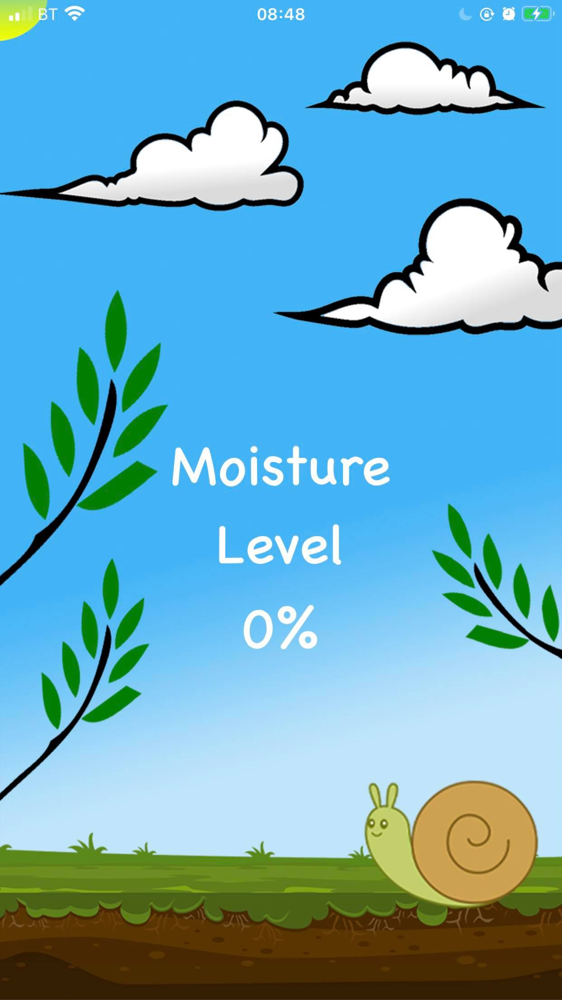

# Envrio
A Device with and IOS app to monitor soil moisture

Hardware:
Esp32 and Sparkfun moisture sensor,
Programmed in Arduino IDE , communicates via BLE to an IOS app

Ios App:
Made in Xcode (swift)

Why?
This project was just made over a weekend for fun

App Screen:

In Use:

